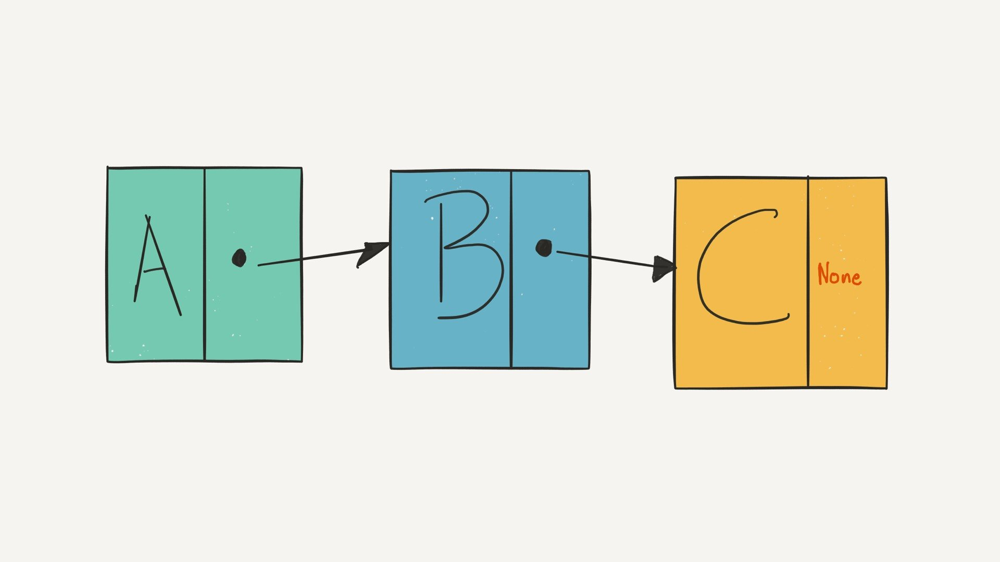

# Wyvern

## Symbol WYV

representation of wyvern (intrinsics) ltd. shares and general cryptographic currency with an exchange rate to bitcoin core.

## Why a new Blockchain and How does it work 
### 1. ICOs generally require preinvestment and require to split coins of an existing blockchain

we do not want to depend on ethereum unfortunately

### 2. Seed Investment

Launching a company requires the goodwill of seed investors which is hard to reflect at *nominal* (crypto)currency. we're reflecting the non-tangible value of pre-seed immaterial assets and startup potental with [preorders] and [orders]. as an investor or crypto trader you may select whether your on-the-fence is entirely anonymous or you may leave a comment indicating your identity or stake in bitcoin, polkadot or dogecoin by leaving a wallet address

### 3. Programming Language

Python3 and Perl6

## FAQ

### 1. is this a ERC-20 token?

no

### 2. proof of work PoW or proof of stake PoS? 

PoW and no

### 3. how much is it worth? 

it's turning from a stablecoin of half value of 50€cent to 1€ and after the seed round is compeleted in fluctuating crypto currency exposed to natural evolution and no hard limit on marketcap/coins issued

### 4. how does it compare to tezos?

exactly, atm. 

### 5. what am i supporting? 

Wyvern coin is for a contactless ECDHE/Curve25519 + RSA Enclave and ARM Silicon, Password Keyboard emulator is crypto-stock LLC, Lightning + USB

### 6. who is behind this? 

a hacker collective of fluently confirming and denying participants who may have ot have not met, and may never meet

### 7. taxes? 

please consult your local tax advisor for bitcoin-like assets

### 8. wallet? 

we provide a wallet app until the coin has evolved onto exchanged

### 9. copyright or license? 

no

### 10. contact

hi@wyvern.ch
